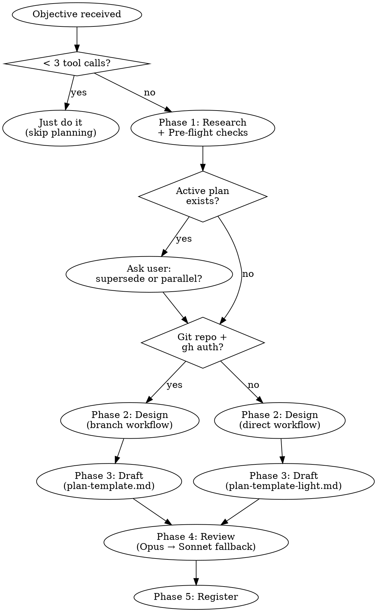

# Blueprint — Construction Plan Generator

Create a construction plan for a multi-step engineering task. `$ARGUMENTS` format: `<project> <objective>` — project name (for locating code and naming the file) and a one-line goal.

**Core principle**: The plan's only reader is an AI agent with zero prior context. Every line must serve cold-start execution — not human reporting, not status theater.

Example: `/blueprint myapp "migrate database to PostgreSQL"`

## Prerequisites

- **Required**: Claude Code
- **Recommended**: [git](https://git-scm.com/), [GitHub CLI (`gh`)](https://cli.github.com/) authenticated — enables full branch/PR/CI workflow. Without them, Blueprint auto-switches to direct mode.
- **Optional**: Opus model access (enhances review quality), memory system

## Decision Flow

**Key branch points**: If the task needs fewer than 3 tool calls, skip planning entirely. If pre-flight detects no git repo or no `gh` auth, use direct workflow with the light template (no branches, PRs, or CI gates). If an active plan already covers the same objective, ask the user before creating a duplicate. If Opus is unavailable for review, fall back to Sonnet.

## Phase 1 — Research

Gather the minimum context needed to make sound design decisions.

0. **Pre-flight checks** — run all checks before any planning work. If any check fails, degrade gracefully or stop and ask; never guess.
   - `git rev-parse --is-inside-work-tree`: if false (not a git repo), set workflow mode to "direct" and skip all remaining git pre-flight checks. The skill still works for non-git tasks.
   - `gh auth status`: if the command fails, warn the user and set workflow mode to "direct" (no PR/CI gates). If multiple accounts are authenticated, report all accounts and ask the user to confirm which one to use before any remote operation.
   - `git config user.name` and `git config user.email`: if either is unset, **stop and ask the user**. Never auto-configure git identity — wrong attribution in commit history is permanent.
   - `git remote -v`: if empty (no remote configured), warn the user and set workflow mode to "direct" — PR/CI operations are impossible without a remote. If a remote exists, record the URL protocol (SSH vs HTTPS) for reference — do not assume or switch protocol.
   - **Default branch detection**: run `git symbolic-ref refs/remotes/origin/HEAD 2>/dev/null | sed 's@^refs/remotes/origin/@@'`. If this fails (ref not set), try `git remote show origin 2>/dev/null | awk '/HEAD branch:/ {print $NF}'`. Store the result as `{default-branch}`. If both fail, fall back to `main` and log the fallback in the plan's Design Decisions section. Avoid `git remote set-head --auto` — it modifies local refs and requires network access, which is inappropriate for a pre-flight check. Use `{default-branch}` throughout the plan template — never hardcode `main`.

1. If `memory/MEMORY.md` exists, read it to find the project's path and current status. If absent, rely on codebase scanning (steps 2-4 below).
2. Read the project's CLAUDE.md, README, and package.json (or equivalent entry point).
3. Read existing plans in `plans/` for the same project — avoid duplicating or contradicting active plans.
4. Scan source code: directory structure, key modules, dependency graph, test setup.
5. If the objective is ambiguous, **ask the user** targeted clarifying questions. Never guess intent.

Output a brief context summary (5-10 lines) before proceeding. Do not ask for confirmation — proceed to Phase 2.

## Phase 2 — Design

Make architectural and sequencing decisions.

1. Break the objective into steps. Each step = one PR's worth of change. A step is one-PR sized when: (a) a reviewer can understand the full diff in a single review session, (b) it changes ≤15 files, (c) it has a single logical intent describable in one sentence. If a step violates any of these, split it. Target 3–12 steps total. If the objective naturally decomposes into fewer than 3 steps but each step is non-trivial (multiple files, CI requirements), a 2-step plan is acceptable — do not artificially split to reach the target. If the objective requires more than 12, split into sequential plans — each plan covers one coherent milestone.
2. For each step, decide:
   - Can it run in parallel with other steps? → draw dependency edges.
   - Does it modify shared files? → must be serial with other steps touching those files.
   - Is it risky (large moves, entry point rewrites, breaking changes)? → mark for worktree isolation.
   - Model assignment:
     - **Opus**: architectural decisions affecting 3+ modules, risk assessment for breaking changes, review and audit tasks, steps where a wrong decision is expensive to reverse.
     - **Sonnet** (default): implementation, file moves, test writing, config changes, mechanical refactors, search-heavy tasks.
     - **Haiku**: never assigned for plan steps (insufficient reasoning for autonomous execution).
3. Assign Size (S/M/L) per step based on scope, complexity, and risk. This is a judgment call — no formula.
4. Identify invariants — properties that must hold after every single step (e.g., build passes, no SDK leak into core).
5. Identify risks and decide rollback strategy per step.
6. Make key design decisions and record rationale ("chose A because B fails under X, C adds unnecessary complexity").
7. Determine workflow mode:
   - **Git projects with CI**: full branch workflow (branch → Opus review → push → CI green → squash merge via gh CLI). This is the default.
   - **Non-git or docs-only tasks**: direct workflow (edit files in place, no branch/PR). Agent judges which mode applies.

## Phase 3 — Draft

Write the plan file at `plans/{project}-{objective-slug}.md` (create the `plans/` directory if it does not exist: `mkdir -p plans`) following the template below. Generate the slug from the objective: lowercase, replace spaces with hyphens, strip characters that are not ASCII alphanumeric (a-z, 0-9) or hyphens, collapse consecutive hyphens into one, trim leading/trailing hyphens, truncate to 40 characters. If the slug is empty after processing (common for non-Latin objectives like Chinese), use `plan-NN` as fallback where NN is the next available two-digit sequence number (check existing files in `plans/` to avoid collision). Example: "Extract providers into plugins" → `extract-providers-into-plugins`. Full filename example: `plans/myapp-extract-providers-into-plugins.md`.

The plan must be **fully self-contained** — an executing agent reads only the plan file and the project's CLAUDE.md. All branch workflow rules, CI policy, and review gates must be written directly into the plan. Do not reference external documents for critical workflow rules.

### Plan Template

Read `references/plan-template.md` and use it as the plan structure.

If pre-flight checks set workflow mode to "direct" (non-git or no gh auth), read `references/plan-template-light.md` instead.

**Note on non-git / docs-only plans**: Use `references/plan-template-light.md`. Steps use direct file edits without branch/PR/CI gates.

Before finalizing, scan `references/anti-patterns.md` and verify the plan does not contain any listed anti-pattern.

Include an **Operational References** section at the bottom of the generated plan with inline summaries of the mutation and resumption protocols. Do not use file paths to the skill directory — the executing agent does not know where the skill is installed. Use the inline summaries from the plan template (read `references/plan-template.md` or `references/plan-template-light.md` — the section is already included at the bottom). The full protocol files are `workflows/plan-mutation.md` and `workflows/resumption.md` — read these during plan creation to ensure the summaries are accurate.

## Phase 4 — Review

Delegate adversarial review of the complete plan to an **Opus sub-agent**. If the Opus sub-agent fails (API error, timeout, unavailable model), retry once. On second failure, fall back to Sonnet and add a warning to the Review Log: "Reviewed by Sonnet — reduced review depth." Never block plan creation on review infrastructure failure.

Read `references/review-checklist.md` and `references/anti-patterns.md`. Include both documents in full in the Opus sub-agent's prompt so it can execute each checklist item against the plan. The sub-agent does not have access to the skill's installation directory — all review criteria and anti-pattern definitions must be passed inline.

Fix all critical and important findings. Log everything in Review Log.

## Phase 5 — Register

1. Save the plan file (written in Phase 3, refined in Phase 4 via Edit tool).
2. If `memory/MEMORY.md` exists, update it: add a plan entry under the relevant project with `created: {date}` and brief description. If the file does not exist, skip memory registration.
3. Present to user:
   - Plan file path
   - Step count and estimated parallelism
   - Prerequisites checklist (user must confirm before execution begins)

## Rules

- Never write a plan for a task that can be done in under 3 tool calls. Just do it.
- Never fabricate code structure or file paths. Every reference in the plan must be verified against the actual codebase in Phase 1.
- Plans are written in English. Conversation stays in the user's language.
- One plan per file. Never append a new plan to an existing plan file.
- If an active plan already exists for the same project+objective, ask the user whether to supersede or create a parallel plan.
- Code snippets in plans are allowed for key configurations (package.json, tsconfig, etc.) but not for implementation code. Implementation is the executing agent's job.
- When the plan template changes in a backward-incompatible way, increment the format version (`plan-format` field in template header). Executing agents should note version mismatches but not refuse to execute old-format plans.
